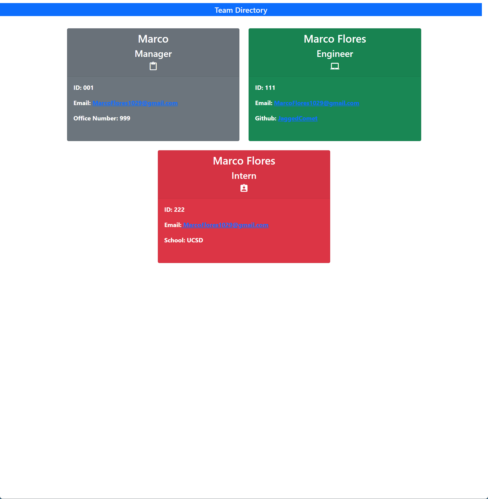
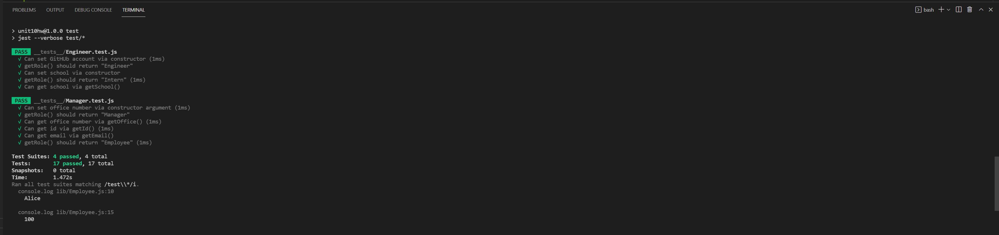

# Team-Profile-Generator
[](https://opensource.org/licenses/BSD-3-Clause)

## Description

The motivation behind this project was to make a node.js program that can take information about the team you have and input them on the page. It takes a manager, along with an engineer or intern, where you can select either multiple times and add them to your team.
It also writes an index.html page that pastes that team on the page for your viewing.


## Table of Contents

- [Installation](#installation)
- [Usage](#usage)
- [Credits](#credits)
- [License](#license)

## Installation

Go to github, and git clone this project. Run npm i in the command line to download necessary files. Run node index.js to start.

## Usage




## Credits

```
node.js
vscode
github
```

## License

BSD3

---

## Features

This project uses inquirer module and fs downloaded through node.js. It logs the input you put in for your team and puts it on a html file that you can launch on your browser.

## How to Contribute

This project is not open to contributions from third parties.

## Tests
You can test it yourself by going to the command line and if you didn't, ```npm i``` if you didn't already, then ```npm run test```.




https://watch.screencastify.com/v/xEldCiySxWD1BTLUAbKg

## Creator Information

https://github.com/JaggedComet

MarcoFlores1029@gmail.com